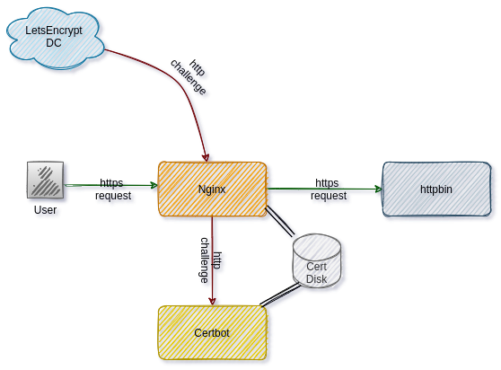

:toc: left

= Nginx + Certbot

This example compose stack has create and auto renew letsencrypt SSL certs for nginx without any manual intervantion.

== Prerequestics

* Docker 19.03.13 or latest
* Docker compose 1.29.2 or latest

== How to use

* Add domain in your DNS provider. Most of the time your instance/LB IP already mapped to the domain.
* Clone this repo
* Update your domain name in `.env` file variable `NGINX_HOST`
* Update your email address in `.env` file variable `LETSENCRYPT_ALERT_MAIL`
* Run `./init-letsencrypt.sh`, if its the first time you are creating certs for the domain.
* Then make sure everything is running `docker-compose ps`
* Now access httpbin service with letsencrypt certificate https://myapp.example.com

== Explanation

Refer https://letsencrypt.org/how-it-works/

=== Architecture

The following version used in this.

* Nginx 1.21.1
* Certbot 1.18.0

The keypoints are

* Certs volume shared between nginx and certbot
* Nginx route http challenge traffic to certbot container
* Nginx route https traffic to upstream service

In the `./init-letsencrypt.sh`

* Nginx first start with self signed certificate
* Certbot will create new certificate from letsencrypt
* Reload nginx

=== Certbot

This certbot has post renew hook up script. That will restart nginx container after the certificate got renewed.

=== Nginx

We used template based nginx. So the env variable used in the template will be auto subsituded at the startup.

== Production deployments

* You don't get the host machine docker sock in production. Reload the nginx via certbot renew post hook.
* If its kube the init script will not be useful.
* Open 80 port only for letsencrypt not to entire world.

== Credits

The idea of init script got from here https://github.com/wmnnd/nginx-certbot/ . We can say this repo is an improvised version of that.

*Author*

[valign=center, halign=center, frame=all, grid=all, stripes=none, options=autowidth,footer]
|===
a|image::https://avatars0.githubusercontent.com/u/834529?s=86[alt="Follow @arulrajnet on Twitter", align="center", link="https://twitter.com/arulrajnet", window=_blank]
|link:https://twitter.com/arulrajnet[@arulrajnet, title="Follow @arulrajnet on Twitter", window=_blank]
|===

